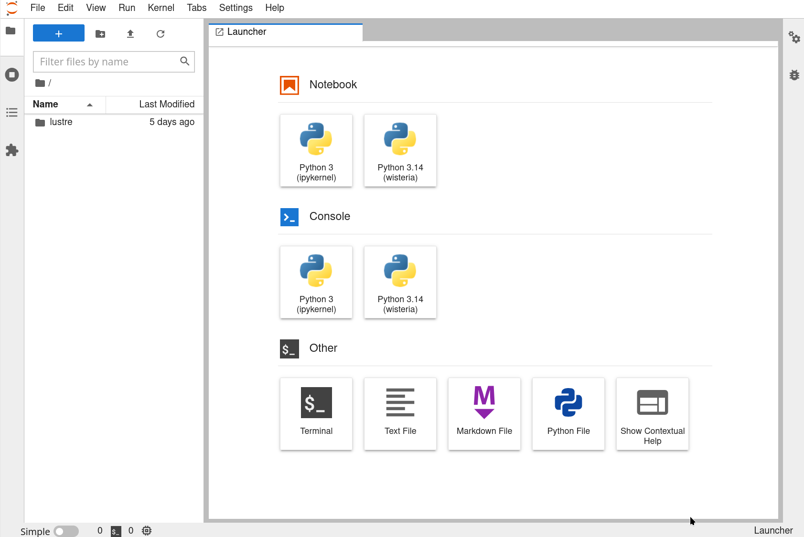

# What is this?

* 計算科学概論（田浦分）の教材
* Wisteria の Jupyter 環境で OpenMP マルチコア、GPU, SIMD, 高性能計算などを、AIも使いながら効率的に学べる環境

# Wisteria での設定作業

* Wisteria に ssh でログイン

```
ssh t?????@wisteria.cc.u-tokyo.ac.jp
```

以下のコマンドはWisteria上で行う

* 本レポジトリをダウンロード

```
ln -s /work/gt69/$USER ~/.notebook/lustre
cd ~/.notebook/lustre
git clone https://github.com/taura/computational-science-material.git
```

* 本授業用のPython環境を導入するためコマンドラインで以下を実行

```
/work/gt69/share/taura/setup_kernel.sh
```

以下のように表示されるはず

```
+ . /work/gt69/share/taura/venv/wisteria/bin/activate
++ ...
++ ...
++ ...
+ python -m ipykernel install --user --name "wisteria" --display-name "Python 3.14 (wisteria)"
Installed kernelspec wisteria in /home/t69???/.local/share/jupyter/kernels/wisteria
```

なにか良からぬことが起きてリセットをしたい場合、 `/home/t69???/.local/share/jupyter/kernels/wisteria` をディレクトリごと削除すればOK

```
rm -rf ~/.local/share/jupyter/kernels/wisteria
```

* うまく行ったら Wisteria の Jupyter 環境 https://wisteria08.cc.u-tokyo.ac.jp:8000/jupyterhub/ へアクセス

`Python 3.14 (wisteria)` というアイコンが現れていることを確認



* 試しに左のファイル一覧から `lustre/computational-science-material/01_intro/intro.ipynb` を開いて実行してみよ。
* AI Tutorなどが無事動いたら成功

# 教材の構成

* `01_intro` は C++ でやりたいが C++ を知らない、 Fortran でやりたいが Fortran を知らない人向けの入門。スキップ可能。
* `02_parallel` 〜 `13_ilp` は OpenMP プログラミング (マルチコアCPU, GPU) および SIMD の基礎。そこにある練習問題を一つ以上解く
* `14_montecarlo` 以降は、易難含めた、計算科学、機械学習ででてくる計算を題材とした応用問題
* この内のどれか、もしくは自分で設定した問題を選んで、CPU, GPU, またはその両方で高速化やその性能測定を行うことが目標

| | トピック | | トピック |
|---|---|---|---|
| `01_intro` | C++/Fortran 入門 | `11_simd` | SIMD |
| `02_parallel` | parallel 構文 | `12_simd_intrinsics` | ベクトル型 |
| `03_for_collapse` | for / collapse | `13_ilp` | 命令レベル並列 |
| `04_schedule` | schedule | `14_montecarlo` | モンテカルロ |
| `05_speedup` | 台数効果の測定 | `15_pde_fdm` | 偏微分方程式 (差分法) |
| `06_reduction` | reduction | `16_nbody` | N体問題 |
| `07_gpu_target` | GPU target | `17_linalg` | 線形代数 (CG・固有値) |
| `08_gpu_teams` | GPU teams 等 | `18_ml` | AI (ニューラルネット) |
| `09_gpu_map` | GPU データ移動 | `19_pinn` | PINN |
| `10_gpu_speedup` | GPU 台数効果 | | |

* 各トピックのディレクトリ直下の `.ipynb` をまず読んで基礎を理解する
* 各トピックの `problems/` の下に練習問題がある。問題ごとにディレクトリがありその直下にある `.ipynb` を開いて作業
  * `problem.md`, `.cpp`, `.f90` があるが `.ipynb` に埋め込まれているので見る必要はない
  * `.ipynb` ではなく自分のエディタで作業推したい人は, `.cpp`, `.f90` を直接開いてもよい
* `TODO` コメントの箇所を埋めるのが課題。
* 分からないときは `.ipynb` から AI チュータ (`%%hey`) に質問できる。
  * 答えを聞くのではなく、一般的な質問や自分の答えへのフィードバックを得るためのもの。
* 計算ノードへのジョブ投入は `%%bash_submit` セルで行う (ログインノードで軽く試すときは `%%bash_` に書き換える)。

