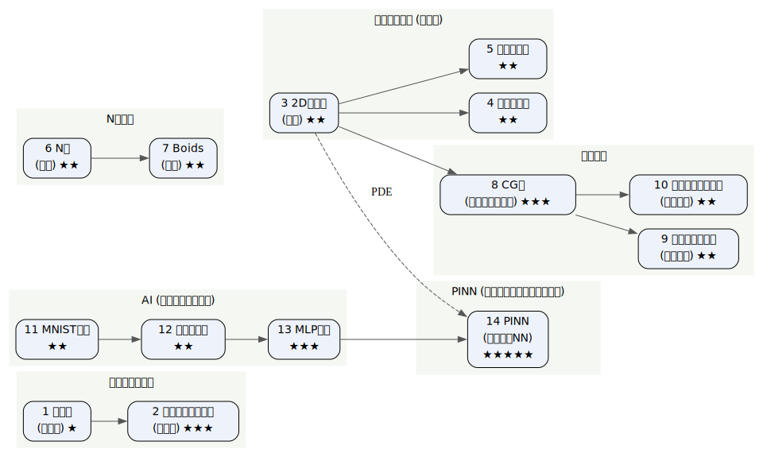

# 目標とそのためのロードマップ

- このコースは, 前半 (`02_parallel`〜`13_ilp`) で **高性能計算の基本スキル (主にOpenMPプログラミング)** を学び, 後半 (`14_montecarlo`〜`19_pinn`) でそれらを使った応用に挑戦する。
- 提出課題では、これらのうちから一問、または自分で興味のある同等以上の難易度の問題を設定して、前半で学んだスキルを駆使して高速化する。
- このページは, 応用問題一覧とその難易度、それらの間の依存関係を示す。課題選定や学習順序の立案に使われたい。
- A -> B は、BがAに依存している、Bをいきなりやるのが難しいと感じたら先にAをやっておくと良い、という意味。

## 応用問題の一覧

| 番号 | テーマ | 問題 | 難易度 | フォルダ |
|---|---|---|---|---|
| 1  | モンテカルロ法 | ガチャ (期待値) | ★ | `14_montecarlo/problems/00_gacha` |
| 2  | モンテカルロ法 | パーコレーション (相転移) | ★★★ | `14_montecarlo/problems/01_percolation` |
| 3  | 偏微分方程式 (差分法) | 2D熱伝導 (定常) | ★★ | `15_pde_fdm/problems/00_heat2d` |
| 4  | 偏微分方程式 (差分法) | 波動方程式 | ★★ | `15_pde_fdm/problems/01_wave` |
| 5  | 偏微分方程式 (差分法) | 拡散方程式 | ★★ | `15_pde_fdm/problems/02_diffusion` |
| 6  | N体問題 | N体 (重力) | ★★ | `16_nbody/problems/00_nbody` |
| 7  | N体問題 | Boids (群れ) | ★★ | `16_nbody/problems/01_boids` |
| 8  | 線形代数 | CG法 (連立一次方程式) | ★★★ | `17_linalg/problems/00_cg` |
| 9  | 線形代数 | 固有振動モード (べき乗法) | ★★ | `17_linalg/problems/01_vibration` |
| 10 | 線形代数 | すごろくの定常分布 (べき乗法) | ★★ | `17_linalg/problems/02_markov` |
| 11 | AI (ニューラルネット) | MNIST 推論 | ★★ | `18_ml/problems/00_mnist_infer` |
| 12 | AI (ニューラルネット) | 回帰の学習 | ★★ | `18_ml/problems/01_regression` |
| 13 | AI (ニューラルネット) | MLP 学習 | ★★★ | `18_ml/problems/02_mlp_train` |
| 14 | PINN | PINN | ★★★★★ | `19_pinn/problems/00_pinn` |

## 依存関係グラフ

矢印 A -> B は「B は A に依存」(B の前に A をやると良い) を表す。

(この図は [roadmap.dot](roadmap.dot) を `dot -Tsvg roadmap.dot -o roadmap.svg` で変換したもの。)

---

## 前半で身につける「道具」(技法 -> 学ぶトピック)

| 道具 | 学ぶトピック |
|---|---|
| 複数スレッドで実行 | `02_parallel` |
| ループ分割 / 多重ループ | `03_for_collapse` (行列ベクトル積など) |
| 負荷分散 | `04_schedule` (マンデルブロなど) |
| 台数効果の測定 | `05_speedup` (行列積) |
| 縮約 (和 / 個数 / 最大) | `06_reduction` (モンテカルロπ, 内積) |
| GPU オフロード | `07_gpu_target`〜`10_gpu_speedup` |
| SIMD / 命令レベル並列 | `11_simd`〜`13_ilp` |

応用問題で使う**部品**はすべて前半で登場する: **行列ベクトル積・行列積・内積・縮約・stencil (近傍平均)・独立試行**。応用問題は「これらの部品を組み合わせて意味のある計算にする」段階。

---

## テーマをまたぐ「つながり」

- **行列積が AI になる**: 前半で並列化した行列積が, そのまま 11 MNIST推論 -> 12 回帰の学習 -> 13 MLP学習 -> 14 PINN の中身になる。
- **同じ2Dラプラシアン行列**: 3 2D熱伝導・8 CG法・9 固有振動モード は同じ行列を扱う。「同じ行列を, 解く (8) / 満たす (3) / 振動させる (9)」。さらに 14 PINN は同じ `-u'' = f` を機械学習で解く。
- **stencil (近傍平均)**: 3 2D熱伝導 を時間発展に拡張したのが 4 波動・5 拡散。
- **O(N²) の相互作用**: 6 N体 と同じ構造の応用が 7 Boids。
- **確率シミュレーション**: 1 ガチャ -> 2 パーコレーション (試行を増やすと相転移が見える)。

---

## おすすめの取り組み順 (易 -> 難)

1 ガチャ -> 2 パーコレーション -> 3 2D熱伝導 -> (4 波動, 5 拡散) -> 8 CG法 -> (9 固有振動モード, 10 すごろく) -> 6 N体 -> 7 Boids -> 11 MNIST推論 -> 12 回帰 -> 13 MLP学習 -> 14 PINN

---

## 面白い到達目標

1. **行列積が AI になる**: 並列化した行列積 -> 11 で手書き数字を認識 -> 13 で自分の NN を学習させ正解率が上がる。
2. **同じラプラシアンを, 解く・満たす・振動させる**: 3 (差分法) -> 8 (CG) -> 9 (固有振動モード) -> 14 (PINN)。1つの行列を軸に, 差分・反復解法・固有値・機械学習の4つの流儀を体験。
3. **相転移を目撃する**: 2 で確率 p を動かすと, 臨界点で浸透確率が急に立ち上がる。
4. **べき乗法で形と順位を出す**: 9 定在波の形 (1Dは sin と一致, 2Dは太鼓の模様) / 10 すごろくで一番止まりやすいマス。
5. **宇宙と群れを動かす**: 6 (重力N体) / 7 (群れ) を SIMD・GPU で加速し, O(N²) の重い計算を実用速度に。

---

## 「技法 × 応用」被覆マップ (どの応用でどの技法が主役か)

| 技法 | 主に使う応用問題 |
|---|---|
| parallel for / collapse | 3, 4, 5, 6, 行列系 |
| schedule (動的負荷分散) | 2 |
| reduction | 1, 3 (残差), 6, 12, 8, 9 |
| GPU (target/teams/map) | 3, 6, 11, 8 (発展課題として) |
| SIMD / ILP / ベクトル型 | 6, 11, 8 の高速化 |
| 反復 (収束まで回す) | 3, 8, 9, 12, 13, 14 |

各応用問題には「発展目標 (マルチコア -> GPU -> SIMD/ILP)」と「性能を比べる」セルがある。どこまで速くできるか挑戦してみよう。
